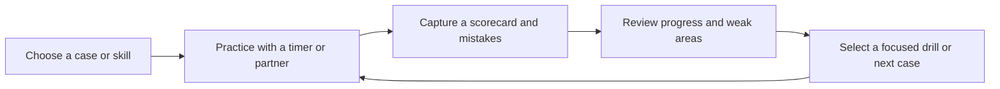

# PracticeLoop — A Personalized Learning Product

**Built by Neeraj Banisetti.** PracticeLoop is a learning and practice platform that connects structured content, timed exercises, feedback and progress tracking into a repeatable improvement loop.

The current content focuses on consulting case interviews. The product work is broader: designing how a learner finds useful material, practices a skill, interprets feedback and decides what to work on next. This repository presents that learning experience as a product portfolio project; it does not claim to be a PM interview curriculum.

[Setup and feature reference](docs/setup-and-features.md)

## The problem and user

An interview candidate can accumulate case books, notes and feedback without a clear next action. More content does not automatically create better practice. The product hypothesis is that a connected practice loop can help learners turn feedback into a focused next session.

**Core job:** “Help me choose what to practice, make the session useful, and show me what needs improvement.”

## The learning loop



| Product capability | Learner value |
| --- | --- |
| Searchable case library and spoiler-aware study | Find suitable material and control when answers are revealed |
| Mock practice and partner mode | Support independent and collaborative practice |
| Scorecards, session log and mistake journal | Turn a session into structured feedback |
| Weak-area recommendations | Connect feedback to a specific next action |
| Timed math, sizing and communication drills | Practice individual skills without repeating a full interview |
| Flashcards and progress views | Support repeated learning and make activity visible |
| Industry primers and framework guides | Build context alongside hands-on practice |
| Installable PWA and offline support | Support use across desktop and mobile contexts |

## Product decisions

| Decision | Rationale | Tradeoff |
| --- | --- | --- |
| One connected practice experience | Keep content, feedback and next steps together | More flows to maintain and explain |
| Skill-specific drills alongside full cases | Let learners focus on a narrow weakness | Drill performance is not the same as interview readiness |
| External AI handoff plus optional in-app AI | Provide a practice path without requiring API spend | Copy/paste adds friction; external service access may require a subscription |
| Optional API usage with a configured spend cap | Make paid practice an explicit choice | Usage tracking and failure handling add operating complexity |
| Invited-user authentication and per-user storage | Restrict access to study content and separate learner records | Requires Supabase setup; current privacy behavior needs deployment verification |
| PWA and offline caching | Reduce installation friction and support repeat use | Cache lifecycle and sign-out behavior need device testing |

## PM skills represented

- **Problem framing:** Focus on the gap between collecting material and knowing what to practice next.
- **Journey design:** Connect discovery, practice, feedback, reflection and the next session.
- **Prioritization:** Combine full-session practice with targeted drills and an optional AI path.
- **Product judgment:** Balance convenience, learning value, operating cost and access controls.
- **Technical fluency:** Integrate Next.js, React, Supabase authentication and storage, server-side AI routes and a service worker.
- **Measurement planning:** Define how to evaluate learning usefulness instead of treating activity alone as success.

These describe decisions visible in the artifact. They do not imply formal research, team leadership, active-user counts or measured learning gains.

## Validation and proposed success measures

This is a portfolio prototype. The production build and TypeScript compilation passed during repository preparation; that is technical validation, not proof of product effectiveness. No completed user study or quantified recruiting outcome is claimed.

A proposed pilot would observe learners selecting a practice task, completing it, saving feedback and choosing a follow-up exercise.

| Question | Proposed measure |
| --- | --- |
| Can learners start useful practice without help? | Completion rate and time to first completed practice session |
| Does feedback lead to a next action? | Share of reviewed scorecards followed by a relevant drill or case |
| Is the loop useful enough to revisit? | Return to a second practice session over a defined pilot window |
| Are learners improving? | Repeated rubric assessments with consistent scoring, reviewed by a human |
| Is the experience dependable? | Failed saves, blocked sign-ins and AI errors per attempted action |

Retention and practice streaks are supporting signals, not proof of learning. AI scorecards need calibration; self-ratings and interview outcomes have confounding factors.

## Implementation

The app uses Next.js, React, TypeScript and Tailwind, with Supabase authentication and database migrations. Case content and exhibits are served through authenticated server paths. Optional Anthropic integration supports in-app practice; the external-prompt handoff remains available without an API key.

The data build currently bundles **195 cases, 19 frameworks, 42 industry primers and 10 firm profiles**. Counts describe repository coverage, not content quality or learning impact. Two cases were reported as unlinked to frameworks in the preparation build.

| Area | Location |
| --- | --- |
| Pages and server routes | `app/` |
| Interface components | `components/` |
| Auth, practice logic and content loaders | `lib/` |
| Structured learning content | `data/` |
| Authenticated exhibits | `private/` |
| Offline support | `public/sw.js` |
| Data bundling | `scripts/build-data.mjs` |
| Database migrations | `supabase/migrations/` |

## Local setup and deployment

```bash
npm ci
cp .env.example .env.local
# Configure the Supabase project and invited-user settings.
npm run dev
```

For a production check, run `npm run build`. See the [setup reference](docs/setup-and-features.md) for migrations, sign-in, AI configuration and Vercel deployment.

**Repository status:** Private source repository; the app is not hosted by this GitHub publication. The included case-book material is intended for personal study, so keep this repository private. A public recruiting demo would need original or licensed sample content and a reviewed demo experience.

## Next product iteration

Prioritize validating the core loop before expanding the library: simplify first-session onboarding, test whether recommendations are understandable, calibrate scorecards and verify reliable feedback saving. Build a public sample-content demo only after separating it from the private study library.
